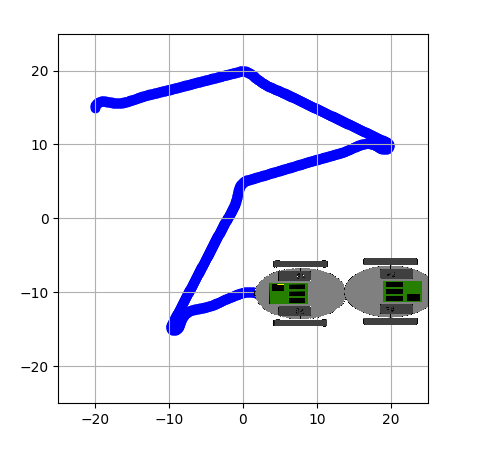

# Path Tracking With PID Controller Simulation For Differential Drive Robots in Python

- In this project, I've implemented a simple goal-to-goal PID controller to control a robot with a Differential Drive. 
- In the simulation, the robot can follow the route given itself using the PID controller.
- I've used the mathematical models of Differential Drive robots to simulate the physical behaviour of the robot.

## Example Simulation

Here you can see an example simulation for:
```
start = State(-20, 15, math.radians(90))
targets = [State(0, 20, 0), State(20, 10, 0), State(0, 5, 0), State(-10, -15, 0), State(0, -10, 0), State(8, -10, 0)]
```



Note: An extra robot has been placed in (20,-10) coordinates. The placement of this robot can be changed by giving an extra x and y coordinates in function drawPlot.

##### Follow these steps to run this project(Assuming Python3 and PipEnv has been already installed):


```
git clone https://github.com/BurakDmb/DifferentialDrivePathTracking.git
cd DifferentialDrivePathTracking

conda create -n difdrive python=3.7 -y
conda activate difdrive

conda install matplotlib scipy numpy flake8 -y

python main.py
```
